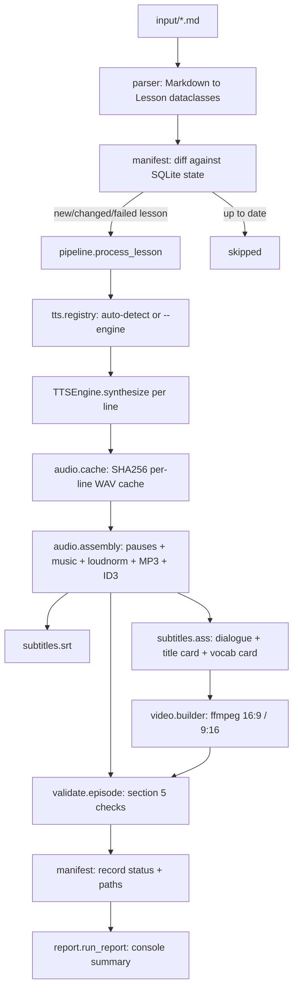

# Dorosak Podcast Factory

Turns Dorosak's Markdown lesson scripts into fully-produced podcast
episodes: multi-voice MP3 audio, 16:9 and 9:16 MP4 video with burned-in
subtitles and a Key Vocabulary end card, plus standalone `.srt` and
metadata JSON — automatically, idempotently, at any scale from 50 lessons
to 10,000+.

## Quickstart

1. Install FFmpeg and pick at least one TTS engine — see `OPERATOR_TODO.md`.
2. `cp .env.example .env` and fill in your chosen engine's credentials.
3. `cp config.example.yaml config.yaml` (optional — defaults work fine).
4. `python -m dorosak_factory run --dry-run` — see the plan and estimated cost.
5. `python -m dorosak_factory run` — process everything.

Full test suite (no API keys needed — uses a built-in silent test engine):

```bash
python -m venv .venv && .venv/bin/pip install -r requirements.txt
.venv/bin/pytest tests/ -v
```

## Architecture



Package layout:

```
dorosak_factory/
  cli.py          # python -m dorosak_factory <run|status|validate|cost-report>
  pipeline.py     # orchestrates one lesson end to end
  config.py       # config.yaml + .env loading, typed, documented defaults
  parser/         # Markdown -> Lesson dataclasses
  tts/
    base.py, registry.py, retry.py, chunking.py, voice_roles.py
    engines/      # null, kokoro, azure, openai, google, polly, elevenlabs
  audio/          # cache, pause/music assembly, loudness, MP3+ID3
  subtitles/      # SRT + ASS (dialogue, title card, vocab card)
  video/          # ffmpeg 16:9/9:16 builder
  manifest/       # SQLite: content hash -> outputs, skip logic
  validate/       # per-episode section-5 checks
  report/         # run summary: counts, cost, failures
tests/
```

## How reruns work

Every lesson's textual content is hashed (`manifest.compute_content_hash`).
On `run`, each lesson in `input/` is compared against its last recorded
manifest entry:

- **New** (no entry) → processed.
- **Content changed** (hash differs) → reprocessed — e.g. you fixed a typo.
- **Previously failed** → retried automatically.
- **Engine changed** (you switched providers) → reprocessed with the new engine.
- Otherwise → **skipped**.

Below the lesson level, the **per-line audio cache** (`audio/cache.py`)
means even a *processed* lesson usually only resynthesizes the lines that
actually changed — a one-word typo fix in turn 12 doesn't re-synthesize
turns 1–11.

Use `--force` to reprocess everything regardless of state, or `--only
cat31:5` / `--only cat31` to scope a run to one lesson or category.

## Watching a run live from GitHub

`--live-status` commits and pushes a `STATUS.md` file (progress counts,
last-completed lesson, any failures) to the repo after every completed
lesson, so a team can watch a long batch progress from GitHub without
needing access to the machine running it:

```bash
python -m dorosak_factory run --only cat30 --formats audio --live-status
```

This is **code/status only** — it never commits generated audio or video
(those stay gitignored; upload finished episodes to wherever your team
actually distributes them, e.g. a shared Drive folder). Opt-in and off by
default. A push failure (offline, remote ahead, no git repo at all) logs a
warning and never interrupts the actual run — producing episodes always
takes priority over the status file staying current.

## Adding a new lesson file

Drop a new category Markdown file into `input/` (same format as the two
sample files — see `INSTRUCTIONS.md` section 3 for the exact structure) and
run `python -m dorosak_factory run`. Nothing else to configure — it's
picked up automatically.

## Switching TTS engines

Two ways:

- **Per-run override**: `python -m dorosak_factory run --engine openai`
- **Persistent default**: set `tts.engine: openai` in `config.yaml`, or
  just add that provider's credentials to `.env` and remove/lower-priority
  any provider ahead of it — the auto-detection chain (`tts/registry.py`,
  priority: kokoro → azure → openai → google → polly → elevenlabs) picks
  the first one that's actually configured.

No code changes are needed for either path — this is enforced by the
`TTSEngine` interface (`tts/base.py`): every adapter takes the same
`(text, voice_role, speed)` and returns the same `SynthesisResult`.

## Adding a new engine adapter

Writing one adapter file + one config block, touching nothing else, is a
hard design requirement. Steps:

1. Create `dorosak_factory/tts/engines/myprovider_engine.py`:

   ```python
   from __future__ import annotations
   from collections.abc import Mapping
   from pathlib import Path
   from typing import TYPE_CHECKING

   from dorosak_factory.tts.base import Capabilities, SynthesisResult, TTSEngine

   if TYPE_CHECKING:
       from dorosak_factory.config import Config

   class MyProviderEngine(TTSEngine):
       name = "myprovider"
       DEFAULT_VOICE_MAP = {
           "host": "...", "female_1": "...", "male_1": "...",
           "female_2": "...", "male_2": "...", "neutral_1": "...",
       }

       def __init__(self, api_key: str, work_dir: Path, voice_map: dict[str, str] | None = None):
           ...  # lazy-import your SDK here, not at module scope

       @classmethod
       def is_available(cls, env: Mapping[str, str]) -> bool:
           return bool(env.get("MYPROVIDER_API_KEY"))

       @classmethod
       def availability_hint(cls) -> str:
           return "Set MYPROVIDER_API_KEY in .env"

       @classmethod
       def from_config(cls, config: "Config") -> "MyProviderEngine":
           import os
           return cls(api_key=os.environ["MYPROVIDER_API_KEY"],
                       work_dir=config.audio.work_dir / "myprovider_raw",
                       voice_map=config.tts.voice_map.get(cls.name, {}))

       @property
       def capabilities(self) -> Capabilities:
           return Capabilities(supports_speed=True, supports_ssml=False)

       def synthesize(self, text: str, voice_role: str, speed: float = 1.0) -> SynthesisResult:
           voice_id = self._voice_map.get(voice_role)
           if voice_id is None:
               raise ValueError(f"No myprovider voice configured for role '{voice_role}'.")
           # call your SDK, write a 24kHz mono 16-bit PCM WAV, wrap in with_retries(...)
           # for transient failures, return SynthesisResult(...)
   ```

2. Register it in `dorosak_factory/tts/engines/__init__.py`:
   ```python
   from dorosak_factory.tts.engines.myprovider_engine import MyProviderEngine
   default_registry.register(MyProviderEngine)
   ```
3. Add it to the priority chain in `tts/registry.py`'s
   `DEFAULT_ENGINE_PRIORITY` tuple, wherever you want it to sit.
4. Add `MYPROVIDER_API_KEY=` to `.env.example` and a note in
   `OPERATOR_TODO.md`.

That's it — CLI, manifest, caching, audio assembly, and validation all work
against the `TTSEngine` interface and need zero changes.

## Video renderers

Video goes through the same pluggable pattern as TTS: `video/renderer_base.py`
(the `VideoRenderer` interface), `video/renderer_registry.py` (auto-detection
chain, `--renderer` override), `video/renderers/` (one adapter per backend).
Today's only renderer is `static_background` (looped image + burned ASS
subtitles — real, tested, on by default). See `VIDEO_RENDERER_ROADMAP.md` for
the planned local AI-avatar renderer (FLUX.1 + LivePortrait/MuseTalk) and how
future cloud API renderers (HeyGen, D-ID, ...) plug in the same way.

## Testing

```bash
.venv/bin/pytest tests/ -v
```

211+ tests, all real (no mocked filesystem/ffmpeg for the pipeline-level
tests — actual ffmpeg subprocesses run and are verified with ffprobe).
Cloud TTS adapters (openai/azure/google/polly/elevenlabs) are tested with
their SDK client mocked at the boundary — no network calls, no cost. The
built-in `NullEngine` (silent WAV proportional to text length) exercises
the entire pipeline (cache → assembly → subtitles → video → validation →
manifest → CLI) with zero external dependencies.

See `SELF_EVALUATION.md` for exactly what has and hasn't been executed in
this environment.
